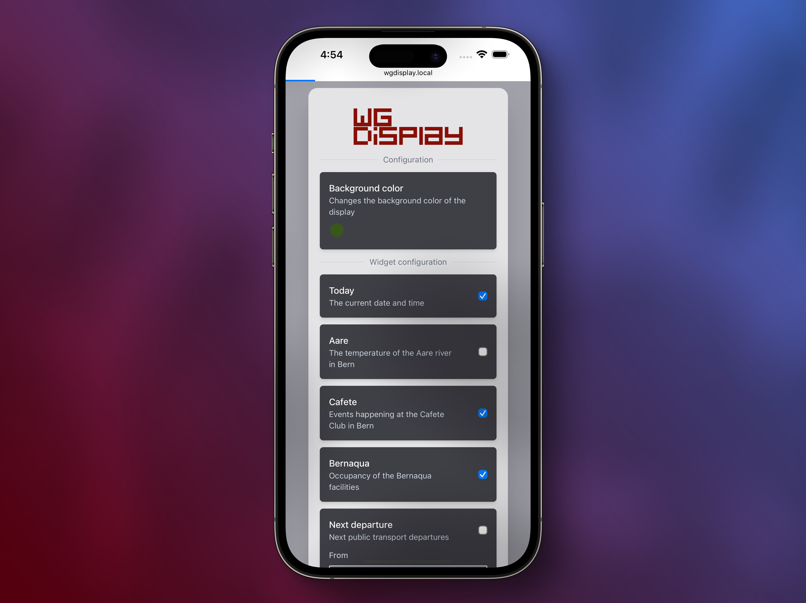
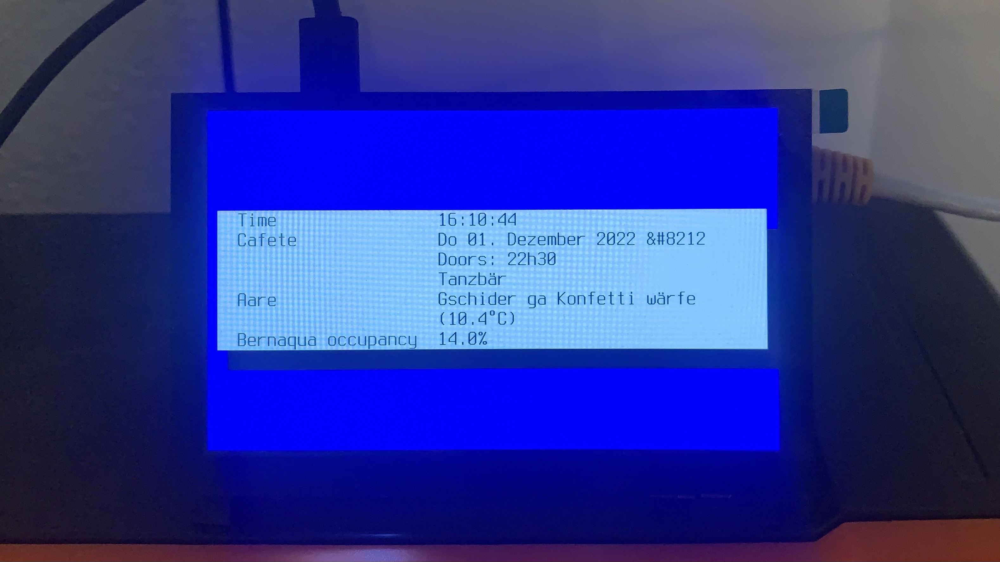

<div align="center">
    <br>
    
    <br>
    <br>
    <strong>
        🦀 Hackable Google Home™ replacement fully built in Rust
    </strong>
    <p>Extensible, open-source and connected to the local community</p>
    <br/>
</div>

[](https://github.com/eliabieri/wg_display/actions/workflows/cargo_test.yml)

## ⭐️ What WG Display can show you

- The next public transport connections between two stations
- The current temperature of the Aare River and whether is a good idea to take a dip
- The current date and time
- The current occupacy in the "Sauna Lorrainebad" in Bern, CH
- .. what ever idea you might have? Simply write your own widget

## ✨ Features

- 🦀 Fully built in Rust
- 🔧 Easily extensible. Write your own widget with ease!
- 🚀 Compiles to single binary
- 🤑 Only needs a Raspberry Pi Zero (or others) and a 15$ display
- ⚙️ Widgets can be configured by the user via a web interface

## 📚 Table of contents

- [⭐️ What WG Display can show you](#️-what-wg-display-can-show-you)
- [✨ Features](#-features)
- [📚 Table of contents](#-table-of-contents)
- [👏 Writing your own widget](#-writing-your-own-widget)
- [🛠️ Assembling the hardware](#️-assembling-the-hardware)
- [📖 Documentation (rustdocs)](#-documentation-rustdocs)
- [🔒 Safety](#-safety)

---


The web interface allows the users to configure system aspects like the background color used on the display or various configuration options of the different widgets.

---


TODO: replace me

## 👏 Writing your own widget

Want your WG Display to show you

- 🥳 the upcoming events in your favorite night club
- 🚮 the trash calendar in your municipality
- 🍺 beers on sale in your local supermarket?  

You've got two options

- [Write your own widget](docs/write_new_widget.md). It's easy using the provided guide and reference implementations
- In case you don't feel capable of writing it yourself, open a [feature request](https://github.com/eliabieri/wg_display/issues/new) and tag it using the `widget request` label

## 🛠️ Assembling the hardware

TODO

## 📖 Documentation (rustdocs)

The rustdocs can be built using

```bash
make docs
```

This generates three seperate documentations, one for each crate

[app](app/target/doc/wg_display/index.html): ```app/target/doc/app/index.html```

[common](common/target/doc/common/index.html): ```common/target/doc/common/index.html```

[frontend](frontend/target/doc/frontend/index.html): ```frontend/target/doc/frontend/index.html```

## 🔒 Safety

This project uses `#[forbid(unsafe_code)]` in all crates to ensure that no `unsafe` Rust is ever added to the project
