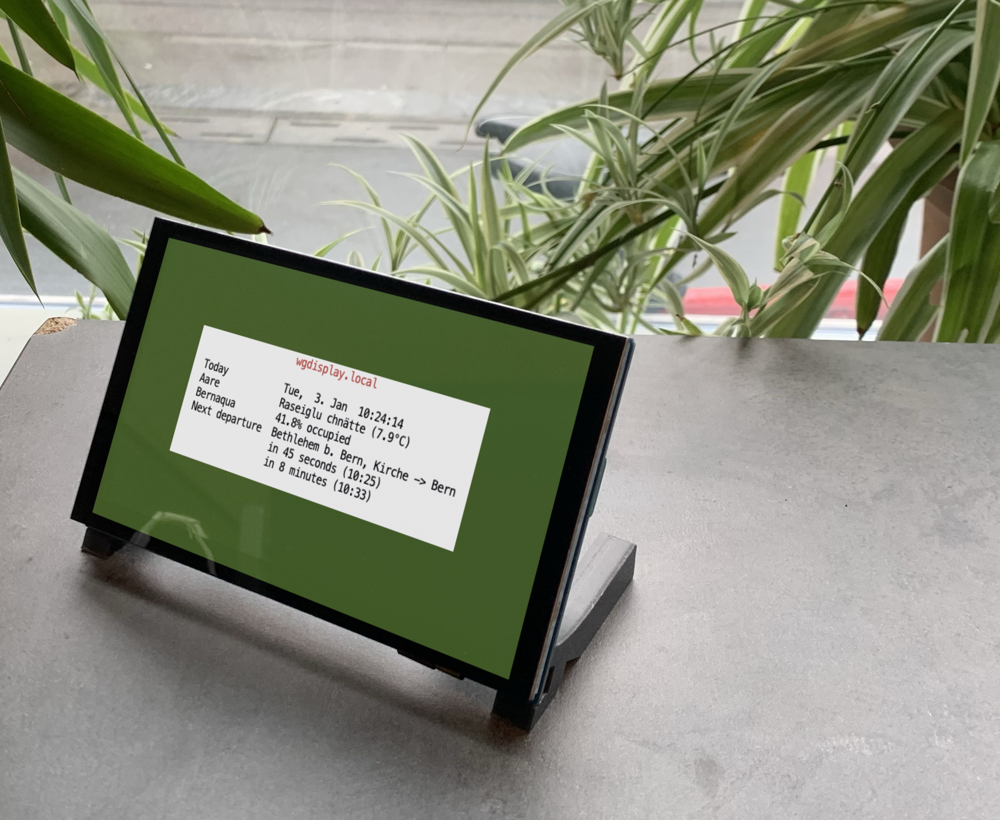

<div align="center">
    <br>
    
    <br>
    <br>
    <strong>
        🦀 Hackable Google Home™ replacement fully built in Rust
    </strong>
    <p>Extensible, open-source and connected to the local community</p>
    <br/>
</div>

[](https://github.com/eliabieri/wg_display/actions/workflows/cargo_test.yml)

## ⭐️ What WG Display can show you

- The next public transport connections between two stations
- The current temperature of the Aare River and whether is a good idea to take a dip
- The current date and time
- The current occupacy in the "Sauna Lorrainebad" in Bern, CH
- .. what ever idea you might have? Simply write your own widget

## ✨ Features

- 🦀 Fully built in Rust
- 🔧 Easily extensible. Write your own widget with ease!
- 🚀 Compiles to single binary
- 🤑 Only needs a Raspberry Pi Zero (or others) and a 15$ display
- ⚙️ Widgets can be configured by the user via a web interface

## 🔮 Upcoming features

- [ ] Allow user to configure WiFi credentials via web interface
- [ ] Starting the binary through systemd

## 📚 Table of contents

- [⭐️ What WG Display can show you](#️-what-wg-display-can-show-you)
- [✨ Features](#-features)
- [🔮 Upcoming features](#-upcoming-features)
- [📚 Table of contents](#-table-of-contents)
- [🚀 Getting started](#-getting-started)
  - [Prerequisites](#prerequisites)
  - [Prerequisites for cross-compilation](#prerequisites-for-cross-compilation)
  - [Building the project](#building-the-project)
- [🛠️ Assembling the hardware](#️-assembling-the-hardware)
- [👏 Writing your own widget](#-writing-your-own-widget)
- [📖 Documentation (rustdocs)](#-documentation-rustdocs)
- [🔒 Safety](#-safety)
- [♻️ Updating the dependencies](#️-updating-the-dependencies)
- [🦾 Developing on target](#-developing-on-target)



---


The web interface allows the users to configure system aspects like the background color used on the display or various configuration options of the different widgets.

## 🚀 Getting started

### Prerequisites

```bash
# Install WebAssembly target
rustup target add wasm32-unknown-unknown
# Install trunk for building the frontend
cargo install --locked trunk
# Install NPM dependencies
cd frontend && npm install
```

### Prerequisites for cross-compilation

First, install [docker](https://www.docker.com), then

```bash
cargo install cross --git https://github.com/cross-rs/cross
```

### Building the project

```bash
# Native build
make
# Cross compilation (Raspberry PI Zero 1 / Zero W / Zero WH)
make app_arm
# Cross compilation (Raspberry PI 2 / 3 / 4 / Zero 2 W)
make app_armv7
```

Then simply copy over the generated binary to the target and run it.

```text
💡 To run it at boot, simply add the path to the binary to the end of the `~/.bashrc` file.
```

## 🛠️ Assembling the hardware

WG Display is best deployed on a Raspberry PI and a cheap display hat.

```text
💡 Even a Raspberry PI Zero is sufficient! 
The application is very ressource efficient and generally only utilizes around 3% CPU on a Raspberry PI 3B.
```

Some displays that are tested to be good

- [5" MIPI DIS Display](https://t.ly/fWl3)
  - ✨ Requires no driver
  - ✨ Includes stand
  - 📐 Large enough to display ~ 6 widgets
  - 💲💲💲
- [3.5" HAT Display](https://t.ly/DfWJ)
  - ✨ Includes enclosure for wall mounting
  - ⚠️ Requires a [driver](https://github.com/goodtft/LCD-show/blob/master/MHS35-show)
  - 📐 Large enough to display ~ 3 widgets
  - 💲
- [3.5" HAT HDMI Display](https://t.ly/l2Rd)
  - ✨ Requires no driver
  - 📐 Large enough to display ~ 3 widgets
  - 💲💲
- Any other display you might find
  - WG Display uses the terminal for rendering, so there are no special display requirements

## 👏 Writing your own widget

Want your WG Display to show you

- 🥳 the upcoming events in your favorite night club
- 🚮 the trash calendar in your municipality
- 🍺 beers on sale in your local supermarket?  

You've got two options

- [Write your own widget](docs/write_new_widget.md). It's easy using the provided guide and reference implementations
- In case you don't feel capable of writing it yourself, open a [feature request](https://github.com/eliabieri/wg_display/issues/new) and tag it using the `widget request` label

## 📖 Documentation (rustdocs)

The rustdocs can be built using

```bash
make docs
```

This generates three seperate documentations, one for each crate

[app](app/target/doc/wg_display/index.html): ```app/target/doc/app/index.html```  
[common](common/target/doc/common/index.html): ```common/target/doc/common/index.html```  
[frontend](frontend/target/doc/frontend/index.html): ```frontend/target/doc/frontend/index.html```

## 🔒 Safety

This project uses `#[forbid(unsafe_code)]` in all crates to ensure that no `unsafe` Rust is ever added to the project

## ♻️ Updating the dependencies

```bash
# To update the dependencies in all crates, simply run
scripts/update_dependencies.sh
```

## 🦾 Developing on target

When developing, an occasional run on a target may be required.  
You can the following script as a template to copy over the binary to the target and restart it

```bash
#!/bin/sh
set -e

# Note:
# - Add public key to authorized_keys on target
# - Enable root ssh login: https://raspberrypi.stackexchange.com/questions/48056/how-to-login-as-root-remotely

make app_arm
ssh pi@wgdisplay.local "sudo /usr/bin/pkill -9 wg_display || true"
scp /Users/eliabieri/git/wg_display/app/target/arm-unknown-linux-gnueabihf/release/wg_display pi@wgdisplay.local:/home/pi
ssh pi@wgdisplay.local "sudo reboot"
```
