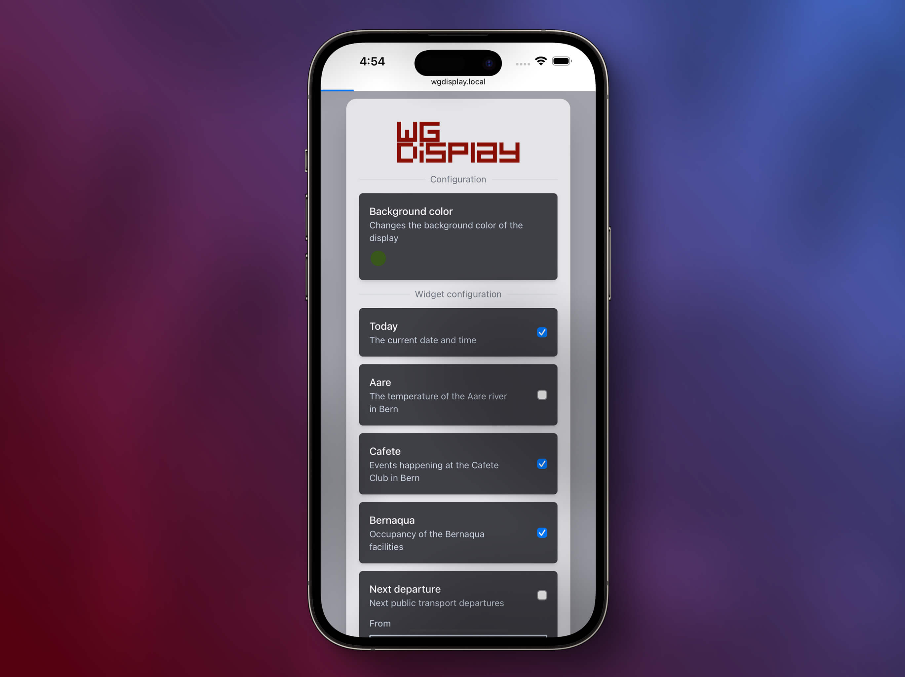

# WG Display - Project Report

Report for the course Project 2  
Author: Elia Bieri  
Supervisor: Michael Röthlin  
Date: 03.01.2022  


<div class="page"/>

## Table of contents

- [Abstract](#abstract)
- [Introduction](#introduction)
  - [Motivation](#motivation)
  - [Deliverables](#deliverables)
- [Requirements](#requirements)
  - [Functional](#functional)
  - [Non-functional](#non-functional)
- [Method](#method)
  - [Project management](#project-management)
  - [Repository settings](#repository-settings)
- [System architecture](#system-architecture)
  - [Programming language](#programming-language)
  - [Components](#components)
  - [Configuration frontend](#configuration-frontend)
  - [Display renderer](#display-renderer)
  - [Web server](#web-server)
  - [Configuration persistence](#configuration-persistence)
  - [Cross compilation](#cross-compilation)
  - [Build process](#build-process)
  - [Tests](#tests)
  - [Continuous integration](#continuous-integration)
  - [Deployment](#deployment)
- [Results](#results)
- [Future extensions](#future-extensions)
- [Glossary](#glossary)
- [Appendix](#appendix)
  - [The main README.md of the project](#the-main-readmemd-of-the-project)
  - [Documentation on how to write a new widget](#documentation-on-how-to-write-a-new-widget)
- [Declaration of Authorship](#declaration-of-authorship)

<div class="page"/>

## Abstract

The WG Display is a device that shows information relevant to people living together.
The information is displayed on a screen that is mounted on the wall or placed on a counter.  
Earlier prototypes of such a device were devloped over the years, but they never reached a state where they could be used by other people.

This project aims to develop a new version of the WG Display that is more robust, easier to configure and better documented.

The result of this project is a working prototype of the WG Display that is user friendy, extensible, can be configured by the users and is well documented.

## Introduction

### Motivation

Over the years living with together with different people, the need arose to have a central place for displaying certain information that is relevant to all room mates. This information could be anything from the current weather, the next bus departures from the nearest public transport station to the temperature of the Aare river. The idea is to have a central place where all this information is displayed. This place is the WG Display.

Since we had quite a bit of experience with the Raspberry Pi, we decided to use it as the main controller.  
Together with a 5" display case that we had lying around, we were able to quickly build a prototype.
The software was implemented in Python, which allowed us to quickly develop the first version of the software.  

Over time, the software was extended to support more features.  
Guests coming over to our place started to take notice and wanted to have a WG Display of their own.  

The problem was, that our solution was "too hacked together".  
There was no way to configure it to the user's needs.  
We also had occasional problems with the software crashing, which was hard to debug.  

That's how the idea of a complete rewrite of the software arose.  
The need for such a display was clearly validated over the years and we had enough time to determine the shortcomings of the previous solution.  
The new software should be more robust, easier to configure and better documented.

<div class="page"/>

### Deliverables

The deliverables for this project are:

- The codebase of a working prototype of the application
- Documentation of the codebase
- A GitHub repository that forms the basis for growing a community around the project
- A project report that describes the project and the software architecture
- A presentation that explains the project and the software architecture

## Requirements

### Functional

- Easy deployment (compile to a single binary)

### Non-functional

- The sofware should be robust and crash as little as possible.
- Users should be able to configure the software to their needs.
- Configuration changes should be applied without restarting the software.
- The software should be well documented.
- The documentation should be fun to read.
- The project should be open source and available on GitHub.
- The project should be easy to contribute to.

<div class="page"/>

## Method

### Project management

Since the project was developed in a way that allowed for contributions from multiple people, GitHub was used not only as a code repository, but also as a project management tool.  

The GitHub project board was used as a task management tool.


This has the advantage, that the project board is tightly integrated with the code repository.  
Tasks can be connected to pull requests and issues.  

Tasks were assigned to a milestone, that represented the the end of the Project 2 course.  


Since tasks were subdivided into smaller tasks, the milestone view gave a nice overview of the progress of the project.

<div class="page"/>

### Repository settings

The GitHub project was configured to enforce several rules:

- No user should be allowed to push directly to a non feature branch.
  This was achieved by setting a branch protection rule that required a pull request before merging.
- All pull requests required all status checks to pass before they could be merged.
  This was achieved by setting a branch protection rule that required all status checks to pass before merging.
- Prevent force pushes on non feature branches.
- Prevent merge commits from being pushed to non feature branches.
  This ensures a linear commit history.

With this being setup, the project should be ready for contributions from multiple people.

<div class="page"/>

## System architecture

### Programming language

The programming language of choice for this project was Rust.

Rust is a systems programming language that is designed to be fast, reliable and secure.  
It's extensive type system ensures that the code is safe and robust.  
The language is also very well suited for writing concurrent code, which is a requirement for this project.
Since Rust can be compiled to web assembly, it could also be used to write the configuration frontend.
Furthermore, the developer experience is very good. This is reflected in the [Stack Overflow developer survey](https://survey.stackoverflow.co/2022/), where Rust is ranked as the most loved programming language for the past seven years.
Last but not least, Rust has a very active community and a big ecosystem of `crates` (libraries) that simplified the development of the project greatly.

Given all this, Rust presented itself as the perfect choice for this project.

### Components

The codebase is generally structured around three main crates.  

There's the frontend crate. It contains all the sources for the configuration frontend.  
The frontend is a web application that is written using the [Yew](https://yew.rs/) framework.

The app crate contains the main application logic.  
It is subdevided into several modules, each of which is responsible for a specific task.
The renderer module contains the logic responsible for rendering the display output.
The server module contains the logic responsible for serving the configuration frontend and providing a REST API for accessing the system configuration.  
A third module, called shared, holds the configuration persistence logic, that is shared between the renderer and the server.  

Finally, there's the common crate. As it's name implies, it contains code that is shared between the frontend and the app crate.  
It's main content are models (structs) that hold the configuration data and an enumeration that represents the individual widgets and their metadata.

The following diagram shows the crate and module structure of the project.

```text
├── app
│   └── src
│       ├── renderer
│       ├── server
│       └── shared
├── common
│   └── src
└── frontend
    └── src
        └── components
```

<div class="page"/>

### Configuration frontend

The configuration frontend is a web application that allows the user to configure the WG Display.  
The frontend was written using the [Yew](https://yew.rs/) framework.  
Yew is a component-based framework for writing web applications in Rust.  

To style the frontend, the CSS utility framework [Tailwind CSS](https://tailwindcss.com) was used.



<div class="page"/>

### Display renderer

The `renderer` module is responsible for rendering the display output.  

The display output is rendered using the [cursive](https://github.com/gyscos/cursive) which is a `crate` for building terminal-based user interfaces (TUIs).  


<div class="page"/>

### Web server

The `server` module is responsible for serving the configuration frontend and providing a REST API for accessing the system configuration.  
The module uses the [rocket](https://crates.io/crates/rocket) crate for this purpose.  

```rust
/// Saves the system configuration
#[post("/config", format = "json", data = "<config>")]
async fn save_config(config: json::Json<SystemConfiguration>) {
    Persistence::save_config(config.into_inner());
}

/// Returns the system configuration
#[get("/config")]
fn get_config() -> Option<json::Value> {
    Some(json::json!(Persistence::get_config()))
}
```

### Configuration persistence

The configuration is stored in an embedded database called [sled](http://sled.rs).
This database is a key-value store that is optimized for speed and low memory usage.
It could satisfy all the requirements of this project, was easy to use and is actively maintained.

The [serde](https://serde.rs) crate was used to serialize the configuration to JSON before storing it in the database.

### Cross compilation

Since this project is expected to run on all Raspberry Pi models, cross compilation was used to build the project for all supported targets.  

The following targets are supported:

- `arm-unknown-linux-gnueabihf` (Raspberry PI Zero 1 / Zero W / Zero WH)
- `armv7-unknown-linux-gnueabihf` (Raspberry PI 2 / 3 / 4 / Zero 2 W)
- native (whatever the build machine is)

To achieve this, the [cross](https://github.com/cross-rs/cross) project was used.  
This project allows to build Rust projects for different targets using prebuilt Docker images.  
Not having to manually install the required toolchains for each target is a huge advantage.  

<div class="page"/>

### Build process

A goal of the project was to compile down to a single binary.  
In order for this to work, the frontend artifacts need to be embedded into the binary.  
Fortunately, there's a crate called [Rust Embed](https://crates.io/crates/rust-embed) that provides a custom derive macro for embedding files into a binary.

```rust
#[derive(RustEmbed)]
#[folder = "../frontend/dist"]
struct Asset;
```

The files are then accessible at runtime through the `Asset` struct.  

```rust
let filename = "index.html";
let asset = Asset::get(&filename)?;
// asset now contains the contents of index.html
```

Since the frontend artifacts first need to be built before they can be embedded, the build process is like a dependency graph:


First, tailwind is used to build the CSS file from the frontend sources that contain Tailwind classes.  
Then, the frontend sources are compiled using [trunk](https://trunkrs.dev), a WASM webapplication bundler for Rust.

Lastly, the main `app` crate can be compiled.  
The `app` crate depends on the `common` crate and embeds the previously built frontend artifacts.

The result is a single selfcontained binary called `app`.

In order to track these dependencies during the build process, a `Makefile` was used.  

Below you can find a simplified excerpt of it:

```makefile
# Build complete app for the native platform
$(build_native_release): $(dependencies) $(frontend_build)
 cd app && cargo build --release
app: $(build_native_release)

# Build complete app for armv7
target/armv7-unknown-linux-gnueabihf/wg_display: $(dependencies) $(frontend_build)
 cd app && cross build --release --target armv7-unknown-linux-gnueabihf
app_armv7: target/armv7-unknown-linux-gnueabihf/wg_display

## Build Tailwind CSS
$(tailwind_output_css): $(dependencies)
 cd frontend && npm run tailwind-build

## Build frontend artifacts using trunk
$(frontend_build): $(tailwind_output_css) $(dependencies)
 cd frontend && trunk build --release
```

### Tests

TODO

### Continuous integration

Continuous integration was implemented using GitHub Actions.  
There were the following requirements:

- The tests should be run on every push to a feature branch.
- The project should be built for all supported targets on every push to a feature branch.
- A new release should be created for every new version tag on the main branch.

To achieve this, three seperate workflows were created.

The following workflow definition is used to build and publish a new release on every version tag on the main branch:

```yaml
name: Build release
on:
  push:
    tags:
      # Push events to matching v*, i.e. v1.0, v20.15.10
      - 'v*'
env:
  CARGO_TERM_COLOR: always
jobs:
  build:
    runs-on: ubuntu-latest
    permissions:
      contents: write
    steps:
    - uses: actions/checkout@v3
    - name: Add WASM target
      run: rustup target add wasm32-unknown-unknown
    - name: Install cargo dependencies
      run: cargo install cross --locked &&
        cargo install --locked trunk
    - name: Install tailwindcss
      run: cd frontend && npm install
    - name: Build for Raspberry Pi 2/3/4)
      run: make app_armv7
    - name: Build for Raspberry Pi 0/1
      run: make app_arm
    - name: Rename artifacts
      run: |
        mv app/target/armv7-unknown-linux-gnueabihf/release/wg_display app/target/armv7-unknown-linux-gnueabihf/release/wg-display-armv7-unknown-linux-gnueabihf
        mv app/target/arm-unknown-linux-gnueabihf/release/wg_display app/target/arm-unknown-linux-gnueabihf/release/wg-display-arm-unknown-linux-gnueabihf
    - uses: ncipollo/release-action@v1
      with:
          artifacts: "app/target/armv7-unknown-linux-gnueabihf/release/wg-display-armv7-unknown-linux-gnueabihf, app/target/arm-unknown-linux-gnueabihf/release/wg-display-arm-unknown-linux-gnueabihf"
          artifactErrorsFailBuild: true
```

### Deployment

TODO

<div class="page"/>

## Results

TODO

<div class="page"/>

## Future extensions

TODO

<div class="page"/>

## Glossary

- Raspberry Pi: A small single-board computer developed in the UK by the Raspberry Pi Foundation.
- WG: German abbreviation for "Wohngemeinschaft" (shared flat)
- Commit: A commit is a snapshot of the repository at a point in time.  
  It contains all the changes that were made to the repository since the last commit.
- Branch: Used to develop features in isolation from each other.
- Pull request: A pull request is a request to merge a branch into another branch.
- Crate: A crate is a compilation unit in Rust.  
  A crate can be either a binary or a library.
- Cargo: The Rust package manager.
- Makefile: A file that contains a set of directives used by a program called make for automatically building a software program.
- Cross compilation: Cross compilation is the process of compiling a program on one computer to run on a different computer.

<div class="page"/>

## Appendix

### The main README.md of the project

:[README.md](../README.md)

<div class="page"/>

### Documentation on how to write a new widget

:[widget.md](write_new_widget.md)

<div class="page"/>

## Declaration of Authorship


