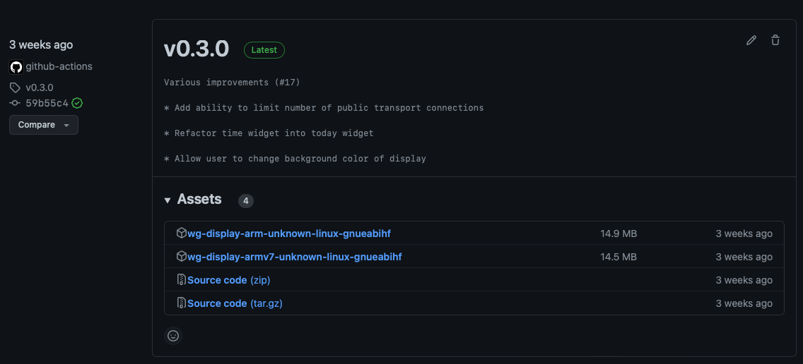

<div align="center">
    <br>
    
    <br>
    <br>
    <strong>
        <h1>WG Display - Project Report</h1>
    </strong>
    <h3>🦀 Hackable information display fully built in Rust</h3>
    <h4>Extensible, open-source and connected to the local community</h4>
    <br/>
    <p>
    Author: Elia Bieri<br>
    Supervisor: Michael Röthlin<br>
    Date: 11.01.2022<br>
    </p>
</div>

<div class="page"/>

## Table of contents

- [Table of contents](#table-of-contents)
- [Abstract](#abstract)
- [Introduction](#introduction)
  - [Motivation](#motivation)
  - [Deliverables](#deliverables)
- [Requirements](#requirements)
  - [Functional](#functional)
  - [Non-functional](#non-functional)
- [Method](#method)
  - [Project management](#project-management)
  - [Repository settings](#repository-settings)
- [System architecture](#system-architecture)
  - [Programming language](#programming-language)
  - [Codebase structure](#codebase-structure)
  - [Configuration frontend](#configuration-frontend)
  - [Display renderer](#display-renderer)
  - [Web server](#web-server)
  - [Configuration persistence](#configuration-persistence)
  - [Concurrency](#concurrency)
  - [Cross compilation](#cross-compilation)
  - [Build process](#build-process)
  - [Tests](#tests)
  - [Continuous integration](#continuous-integration)
  - [Deployment](#deployment)
- [Results](#results)
  - [Outcome](#outcome)
  - [Implemented widgets](#implemented-widgets)
  - [User feedback](#user-feedback)
  - [Reception on GitHub](#reception-on-github)
  - [Difficulties](#difficulties)
- [Future ideas](#future-ideas)
- [Glossary](#glossary)
- [References](#references)
  - [Rust](#rust)
  - [Python](#python)
  - [Other technologies](#other-technologies)
  - [Other references](#other-references)
- [Appendix](#appendix)
  - [README.md](#readmemd)
  - [Documentation on how to write a new widget](#documentation-on-how-to-write-a-new-widget)
- [Declaration of Authorship](#declaration-of-authorship)

<div class="page"/>

## Abstract

The WG Display is a device that shows information relevant to people living together.  
The information is displayed on a screen that is mounted on the wall or placed on a counter.  
Amongst other things, the WG Display can show outside conditions, public transport information and nightclub events. Earlier prototypes of such a device were developed over the years, but they never reached a state where they could be used by people besides me.  

The result of this project is a working prototype of  the WG Display software that was redeveloped from the ground up to be more user-friendly, extensible and configurable by the users. It is written in Rust and can be cross-compiled to run on all Raspberry Pi models. The software is open-source and can be found on GitHub, where others are invited to contribute.

<div class="page"/>

## Introduction

### Motivation

Over the years living with together with different people, the need arose to have a central place for displaying certain information that is relevant to all roommates. This information could be anything from the current weather, the next bus departures from the nearest public transport station, to the temperature of the Aare river. The idea was to have a central place where all this information could be displayed. This place is the WG Display.

Since we had quite a bit of experience with Raspberry Pis, we decided to use them as the main controller. Together with a 5" display case that we had lying around, we were able to quickly build a prototype. The software was implemented using Python, which allowed us to quickly develop the first version of the software. The UI was fully text-based and relied on the magnificent [rich](https://github.com/Textualize/rich) TUI library. Over time, the software was extended to support more features. Guests coming over to our place started to take notice and wanted to have a WG Display of their own. The problem was, that our solution was "too hacked together". There was no way to configure it to the user's needs, as every parameter was hard-coded. We also had occasional problems with the software crashing, which was hard to debug.

That's how the idea of a complete rewrite of the software came up.  
The need for such a display was clearly validated over the last years, and there was enough time to determine the shortcomings of the previous approaches. The new software should be more robust, easier to configure and better documented. My motivation was only strengthened by the fact, that the project would be "my own". I would solve a problem that I had personally, and that I knew solving would not only satisfy me, but many people around me. I also wanted to develop the software in a way that would allow for contributions from other people. The display could only grow in usefulness if other people would contribute code that would serve their own needs.

### Deliverables

The deliverables for this project are:

- The codebase of a working prototype of the application
- Documentation of the codebase that is fun to read
- A GitHub repository configured so that it can form the basis for a growing community around the project
- A project report that describes the project and the software architecture (this document)
- A presentation that explains the project and the software architecture

<div class="page"/>

## Requirements

### Functional

- The software must be easy to deploy (compile to single binary)
- The software must allow the user to configure the displayed widgets
- The user must be able to configure the device via a web interface
- The configuration must be persisted across restarts
- Configuration changes must be applied instantly (without restarting the software)
- The software must be deployable to all Raspberry Pi models
- The software must run on various screen sizes (3.5", 5", 7")
- Prebuilt binaries must be available for download

### Non-functional

- The software shall be robust
  It shall run for weeks without crashing
- The software shall be well documented
- The documentation shall be fun to read
  This is crucial for attracting other contributors
- The project shall be open source and available on GitHub
- The project shall be easy to contribute to
- Contribution guides shall be available

<div class="page"/>

## Method

### Project management

Since the project was developed in a way that allowed for contributions from multiple people, GitHub was used not only as a code repository, but also as a project management tool:


This has the advantage, that the project board is tightly integrated with the code repository.  
Tasks can be connected to pull requests and issues. The board provided all the necessary features to keep track of the project's progress. The project supervisor was also given access to the project board and the codebase. Single tasks were assigned to a milestone, that represented the end of the Project 2 course.


Since tasks were subdivided into smaller subtasks, the milestone view gave a nice overview of the progress of the project.

<div class="page"/>

### Repository settings

To allow for contributions from other people, the GitHub repository was configured to enforce several rules:

- No user should be allowed to push directly to a non feature branch.
  This was achieved by setting a branch protection rule that required a pull request before merging.
- All pull requests required all status checks to pass before they could be merged.
- Prevent merge commits from being pushed to non feature branches.
  This ensures a linear commit history.

These rules should ensure that the codebase stays clean and maintainable.

<div class="page"/>

## System architecture

### Programming language

The programming language of choice for this project was Rust.

Rust is a multi paradigm systems programming language that is designed to be fast, reliable and secure. It's extensive type system ensures that the code is safe and robust, and it lets the compiler catch many errors at compile time. The language is also very well suited for writing concurrent code, which is a requirement for this project. Since Rust can be compiled to [WebAssembly](https://www.rust-lang.org/what/wasm), it could also be used to write the configuration frontend. Furthermore, the developer experience is very good. This is reflected in the [Stack Overflow developer survey](https://survey.stackoverflow.co/2022/), where Rust is ranked as the most loved programming language for the past seven years.
Last but not least, Rust has a very active community and a big ecosystem of `crates` (libraries) that would simplify the development of the project greatly.

Given all that, Rust presented itself as the perfect choice for this project. Besides all the technical reasons, there was also my personal motivation to learn Rust while building a project.

<div class="page"/>

### Codebase structure

The codebase is generally structured around three main crates:

There's the `frontend` crate. It contains all the sources for the configuration frontend. It allows the user to configure the display by accessing a web interface.

The `app` crate contains the main application logic. It is subdivided into several modules, each of which is responsible for a specific task. The `renderer` module contains the logic responsible for rendering the display output. The `server` module contains the logic responsible for serving the configuration frontend and providing a REST API for accessing the system configuration. A third module, called `shared`, holds the configuration persistence logic, that is shared between the renderer and the server as they both need to access the configuration.

Finally, there's the `common` crate. As its name implies, it contains code that is shared between the frontend and the app crate. Its main content are models (structs) that hold the configuration data and an enumeration that represents the individual widgets and their metadata.  

The beauty of using Rust in both the front- and backend is that the same models can be used in both places. In case a model is changed, the compiler will ensure that all places where the model is used are updated accordingly.

The following diagram shows the crate and module structure of the project:

```text
├── app
│   └── src
│       ├── renderer
│       ├── server
│       └── shared
├── common
│   └── src
└── frontend
    └── src
        └── components
```

<div class="page"/>

### Configuration frontend

The configuration frontend is a web application that allows the user to configure the WG Display. The frontend was written using the [Yew](https://yew.rs/) framework. `Yew` is a component-based framework for writing web applications in Rust. All components were written in Rust and HTML. The CSS utility framework [Tailwind CSS](https://tailwindcss.com) was used to style the components. In order for them to live in a single file, `Yew` provides a macro called `html!` that allows to write HTML within Rust:

```rust
// Components can receive properties from their parent component.
#[derive(Properties, PartialEq)]
pub struct ConfigCardProps {
    pub children: Children,
}

#[function_component(ConfigCardComponent)]
pub fn config_card_component(props: &ConfigCardProps) -> Html {
    html! {
        <div class="p-4 my-3">
            { for props.children.iter() }
        </div>
    }
}
```

The example above shows a component that renders child components with some padding.  
`p-4` and `my-3` are Tailwind CSS classes.


The configuration frontend being accessed on an iPhone. The responsive design ensures that the application is usable on all screen sizes.

<div class="page"/>

### Display renderer

The `renderer` module is responsible for rendering the display output using [cursive](https://github.com/gyscos/cursive) which is a crate for building terminal-based user interfaces (TUIs). This approach was chosen because the visual appearance of the display should have a terminal-like look and feel and be minimalistic. There was no goal of building a fancy UI with animations and transitions, but the display was supposed to have its own "visual character".

The output consists of a number of widgets. `Widget` is the term used by this project to describe the individual units of information displayed on the screen. Widgets have a name and a corresponding value, which is updated dynamically.

```rust
pub trait Widget {
    fn new() -> Self
    where
        Self: Sized;

    /// Returns the meta data of the widget
    /// This is used to identify the widget
    /// on the display and on the frontend dashboard application
    fn get_meta_data(&self) -> WidgetMetaData;

    /// Returns the content of the widget
    /// Widgets may use newlines to display multiple lines
    fn get_content(&self) -> &str;

    /// Updates the widget content
    /// This method is called periodically by the renderer
    /// The widget must implement its own timeout logic
    /// to prevent unnecessary updates
    async fn update(&mut self, config: &WidgetConfiguration);
}
```

Every widget must implement the `Widget` trait. Traits are Rust's way of defining shared behavior between different types, and can be compared to interfaces in other languages.  

The renderer first loads the configuration from the embedded database. It then instantiates all widgets that are enabled by the user. After that, it starts a loop in which it calls the `update` method of each widget once a second. This gives the widgets the opportunity to update their content. Most widgets may not need to update their content every second, so they can implement their own timeout logic. After updating the widgets, the renderer renders the content of all widgets to the display. The renderer also queries the `Persistence` module for new configuration changes. If there are any, the renderer updates the widgets accordingly.

The `update` method of the widgets is asynchronous. This allows widgets to perform network requests or other time-consuming tasks. The `renderer` can await the completion of all `update` calls concurrently.

See the [Concurrency](#concurrency) section for more details.

<div class="page"/>

### Web server

The `server` module is responsible for serving the configuration frontend and providing a REST API for accessing the system configuration. The module uses the [rocket](https://crates.io/crates/rocket) crate for this purpose. This makes it very easy to implement the REST API.

The following code excerpt shows the implementation of the REST endpoints required for the configuration frontend:

```rust
/// Saves the system configuration
#[post("/config", format = "json", data = "<config>")]
async fn save_config(config: json::Json<SystemConfiguration>) {
    Persistence::save_config(config.into_inner());
}

/// Returns the system configuration
#[get("/config")]
fn get_config() -> Option<json::Value> {
    Some(json::json!(Persistence::get_config()))
}
```

The server is configured to listen on port 80. Users are advised to configure the hostname of their WG Display to be `wgdisplay`. This way, users can access the configuration frontend by navigating to `wgdisplay.local` in their browser.

### Configuration persistence

The configuration is stored in an embedded database called [sled](http://sled.rs). This database is a key-value store that is optimized for speed and low memory usage. It satisfies all the requirements, was easy to use and is actively maintained.

The [serde](https://serde.rs) crate was used to serialize the configuration to JSON before storing it as UTF-8 encoded byte-string in the database.

### Concurrency

The application needs to do things concurrently:

- The `renderer` needs to update the widgets periodically and re-render the output based on the updated content of the widgets.
- The `server` needs to listen for incoming network requests and serve the frontend files / API.

To achieve this, the project uses the [tokio](https://tokio.rs) async runtime. The `tokio` runtime allows to spawn tasks that run concurrently. Quoting the [tokio task](https://docs.rs/tokio/latest/tokio/task/index.html) documentation:

> A task is a light weight, non-blocking unit of execution.
 A task is similar to an OS thread, but rather than being managed by the OS scheduler, they are managed by the tokio runtime.

The following code shows the main entry point of the application. It instantiates the `renderer`, spawns a `task` for the `server` and then awaits the completion of both the renderer task and the `run` method of the `server`:

```rust
#[tokio::main]
async fn main() {
    let mut renderer = renderer::Renderer::new();
    let _unused = join!(
        tokio::spawn(async { server::serve_dashboard().await }),
        renderer.run()
    );
}
```

### Cross compilation

Since this project is expected to run on all Raspberry Pi models, cross compilation was used to build the project for all supported targets. The following cross-compilation targets are supported for now:

- `arm-unknown-linux-gnueabihf` (Raspberry Pi Zero 1 / Zero W / Zero WH)
- `armv7-unknown-linux-gnueabihf` (Raspberry Pi 2 / 3 / 4 / Zero 2 W)

To achieve this, the [cross](https://github.com/cross-rs/cross) project was used. This project allows building Rust projects for different targets using prebuilt Docker images. Not having to manually install the required tool chains for each target is a huge advantage because it makes it easy to support additional targets.

<div class="page"/>

### Build process

A goal of the project was to compile down to a single binary. In order for this to work, the frontend artifacts need to be embedded into the binary. Fortunately, there's a crate called [Rust Embed](https://crates.io/crates/rust-embed) that provides a custom derive macro for embedding files into a binary:

```rust
#[derive(RustEmbed)]
#[folder = "../frontend/dist"]
struct Asset;
```

The files are then accessible at runtime through the `Asset` struct:

```rust
let filename = "index.html";
let asset = Asset::get(&filename)?;
// asset now contains the contents of index.html
```

Since the frontend artifacts first need to be built before they can be embedded, the build process is like a dependency graph:


First, tailwind is used to build the CSS file from the frontend sources that contain Tailwind classes. Then, the frontend sources are compiled using [trunk](https://trunkrs.dev), a WASM web application bundler for Rust.

Lastly, the main `app` crate can be compiled. The `app` crate depends on the `common` crate and embeds the previously built frontend artifacts.

The result is a single, self-contained binary called `app`. In order to track these dependencies during the build process, a `Makefile` was used.

<div class="page"/>

Below, you can find a simplified excerpt of said Makefile:

```makefile
# Build complete app for the native platform
$(build_native_release): $(dependencies) $(frontend_build)
 cd app && cargo build --release
app: $(build_native_release)

# Build complete app for armv7
target/armv7-unknown-linux-gnueabihf/wg_display: $(dependencies) $(frontend_build)
 cd app && cross build --release --target armv7-unknown-linux-gnueabihf
app_armv7: target/armv7-unknown-linux-gnueabihf/wg_display

## Build Tailwind CSS
$(tailwind_output_css): $(dependencies)
 cd frontend && npm run tailwind-build

## Build frontend artifacts using trunk
$(frontend_build): $(tailwind_output_css) $(dependencies)
 cd frontend && trunk build --release
```

<div class="page"/>

### Tests

This project uses the built-in test support of Rust. Tests are simple functions that are annotated with `#[test]`. They live in the same file as the code they test, but are located in their own module called `tests`. This module is only compiled when running the tests. [Cargo](https://github.com/rust-lang/cargo) provides a command to run all tests in a crate:

```bash
cargo test
```

### Continuous integration

Continuous integration was implemented using GitHub Actions.
There were the following requirements:

- The tests should be run on every push to a feature branch
- The project should be built for all supported targets on every push to a feature branch
- A new release should be created for every new version tag on the main branch

To achieve this, three separate workflows were created.



The above image shows a release that was automatically created. It includes the individual commit messages going into the release and the cross compiled binaries for all supported targets.

<div class="page"/>

### Deployment

Having made the decision to compile the project down to a single binary, the deployment process is very simple. The binary can simply be copied to the Raspberry Pi and executed.

This process is described in the `README` of the project.
It can be found in the [appendix](#readmemd).

<div class="page"/>

## Results

### Outcome

The project was a big success for me.
It yielded a V1.0 release that provides a good foundation for future extensions and improvements.  

The project also allowed me to learn a lot of new things on the way.
I got way more proficient in writing Rust code! Having decided to use many novel technologies like Tailwind, writing web apps with Rust and using GitHub Actions for cross compilation, I almost never felt like I was just doing boring work. With every step on the way, I had to acquire new knowledge and skills, study documentation and exchange with other people.


Picture of the WG Display software running on a Raspberry Pi 3B+ and an attached 5" 800x480 display. The background color can be configured through the configuration frontend.

<div class="page"/>

### Implemented widgets

The following widgets were implemented:

- **Today**  
  Shows the current time and date.
- **Aare**  
  Shows the current temperature of the Aare river and a short description text.  
  Uses the [aareguru API](http://aareguru.existenz.ch).  
- **Bernaqua**  
  Shows the current occupancy rate of the Bernaqua facilities.  
  Uses their internal API.  
- **Cafete**  
  Shows the next upcoming event at the Cafete nightclub.  
  Uses their internal API.  
- **Public transport**  
  Shows the next public transport departures from a specified station to another station.  
  These two stations can be configured via the configuration fronend.  
  The number of connections shown can also be configured.  
  Uses the [Swiss public transport API](https://transport.opendata.ch).  

This is only a minimal set of possible widgets. As the time was limited, I had to focus on building the base application and there was not much time for actually implementing widgets.

### User feedback

The feedback I received from the users (my roommates and guests) was very positive. They especially liked the fact that they can now configure the display on their own. Just having to open a simple URL in the browser was intuitive for everyone.

Since the size of the widget collection is the most important factor for the usefulness of the display, I already received some requests for new widgets. Having a well-structured project gives me a lot of motivation to satisfy these requests and develop many more widgets.

### Reception on GitHub

I wrote a short post that links to the GitHub project for my various social media accounts.  
This resulted in some traffic from people I both know and don't know, resulting in 19 stars on GitHub as of writing this. My hope is that growing the widget collection, implementing additional features and further simplifying the deployment process will hopefully result in other people contributing to the project.

### Difficulties

As I did not have a lot of experience writing software in Rust before starting this project, I had to learn quite a few things along the way. As Rust has a notoriously steep learning curve, I had to be very patient at times.
Features that would have taken me 30 minutes to implement in Python took two days to implement in Rust. Nevertheless, once I was able to solve the problems and the compiler satisfied, I was usually very happy with the result.

<div class="page"/>

## Future ideas

The current state of the project provides a good foundation for future extensions. Several features and ideas were not implemented due to time constraints, but would greatly improve the user experience:

- **Adding more widgets**  
  Currently, only a few widgets are implemented.  
  Implementing more widgets could help to make the project more popular.
- **Supporting more widget output formats**  
  Currently, widgets can only output their content as text.  
  Supporting more output formats would allow for more interesting widgets.  
- **Beautifying the display UI**  
  Currently, the display UI is very simple.  
  It would be nice to add some more styling to make it look nicer.
- **Improved error handling**  
  Various places in the codebase can `panic`.  
  Some of these could be refactored to handle errors gracefully.  
- **User authentication**  
  The current state of the project does not provide any authentication.  
  This means that anyone with access to the network can change the configuration.  
  This is not a problem for a "WG" but could be a problem when the display is installed in larger networks.  
  A possible solution would be to implement a simple authentication mechanism using a username and password.  
- **Configuring Wi-Fi credentials**  
  Currently, there is no way for the user to configure the Wi-Fi credentials.  
  This means that the Wi-Fi credentials need to be configured manually on the Raspberry Pi.  
  This could be part of the configuration page.  
  The Raspberry Pi would initially have to create its own Wi-Fi network for the user to connect to and configure the Wi-Fi credentials.
- **Updating the application**  
  Currently, the application needs to be updated manually.  
  This could be done by adding a button to the configuration page that would trigger an update.  
  The update would then be downloaded and installed automatically.  
  This would also require the application to be able to update itself.  
  This could be achieved by using a crate like [self_update](https://crates.io/crates/self_update).
- **Dynamically loading widgets**  
  Currently, the widgets are statically defined in the `app` crate.  
  Newly added widgets require a new release of the application.  
  This could be changed by dynamically loading the widgets from a directory.  
  This could be achieved by using a crate like [libloading](https://crates.io/crates/libloading).
- **Selling it as a product**  
  The display could be sold as a product.  
  This would require me to source the hardware, preflash the SD cards and provide support.  
  This would allow even the most inexperienced users to install a WG Display.  
  This idea would first require the software to be
  - self-updating
  - provide a way to configure the Wi-Fi credentials

<div class="page"/>

## Glossary

- Raspberry Pi: A small single-board computer developed in the UK by the Raspberry Pi Foundation.
- WG: German abbreviation for "Wohngemeinschaft" (shared flat)
- Commit: A commit is a snapshot of the repository at a point in time.  
  It contains all the changes that were made to the repository since the last commit.
- Branch: Used to develop features in isolation from each other.
- Pull request: A pull request is a request to merge a branch into another branch.
- Crate: A crate is a compilation unit in Rust.  
  A crate can be either a binary or a library.
- Cargo: The Rust package manager.
- Makefile: A file that contains a set of directives used by a program called make for automatically building a software program.
- Cross compilation: Cross compilation is the process of compiling a program on one computer to run on a different computer.
- WebAssembly: WebAssembly (abbreviated Wasm) is a binary instruction format for a stack-based virtual machine.  
  Wasm is designed as a portable compilation target for programming languages, enabling deployment on the web for client and server applications.
- TUI: Text-Based User Interface
- Rust Module: A Rust module is a collection of Rust code.  
  Modules are used to organize code within a crate and to control the scope and privacy of items.

<div class="page"/>

## References

### Rust

- Rust [https://www.rust-lang.org/](https://www.rust-lang.org/)
- Cargo [https://github.com/rust-lang/cargo](https://github.com/rust-lang/cargo)
- Yew [https://yew.rs/](https://yew.rs/)
- cursive [https://github.com/gyscos/cursive](https://github.com/gyscos/cursive)
- rocket [https://crates.io/crates/rocket](https://crates.io/crates/rocket)
- sled [http://sled.rs](http://sled.rs)
- serde [https://serde.rs](https://serde.rs)
- rocket [https://crates.io/crates/rocket](https://crates.io/crates/rocket)
- tokio [https://tokio.rs](https://tokio.rs)
- tokio task [https://docs.rs/tokio/latest/tokio/task/index.html](https://docs.rs/tokio/latest/tokio/task/index.html)
- cross [https://github.com/cross-rs/cross](https://github.com/cross-rs/cross)
- Rust Embed [https://crates.io/crates/rust-embed](https://crates.io/crates/rust-embed)
- trunk [https://trunkrs.dev](https://trunkrs.dev)
- self_update [https://crates.io/crates/self_update](https://crates.io/crates/self_update)
- libloading [https://crates.io/crates/libloading](https://crates.io/crates/libloading)

### Python

- rich [https://github.com/Textualize/rich](https://github.com/Textualize/rich)

### Other technologies

- WebAssembly [https://www.rust-lang.org/what/wasm](https://www.rust-lang.org/what/wasm)
- Tailwind CSS [https://tailwindcss.com](https://tailwindcss.com)

### Other references

- Stack Overflow developer survey [https://survey.stackoverflow.co/2022/](https://survey.stackoverflow.co/2022/)
- aareguru API [http://aareguru.existenz.ch](http://aareguru.existenz.ch)
- Swiss public transport API [https://transport.opendata.ch](https://transport.opendata.ch)

<div class="page"/>

## Appendix

### README.md

:[README.md](README.md)

<div class="page"/>

### Documentation on how to write a new widget

:[widget.md](docs/write_new_widget.md)

<div class="page"/>

## Declaration of Authorship


